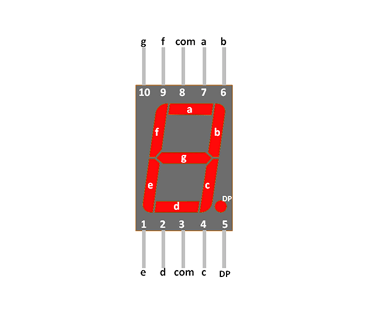

# Week 3  

mmmmmm display

### Agenda  

Learn how to use the segment display and how to impliment it as a function

### What is a segment display?  

A segment display is a array of LED made to display a number or letter.  
Using what you have learned about `digitalWrite` & `digitalRead` to create your own
circuit that works with the given project task.

here is what the digital bindings are binded to  
  
"com" is the common cathode (Ground/GND); "DP" is decimal point

### What is a function?  

A function is a self contained module that is given a predetermined task. In C/C++,  
it is a piece of code where you can bind it to do something in a void "function"  
you probably learned this in APCompSciA or Code.org  

ex:

    void myFunction(){
        cout << "Hi Mom, I'm on TV!"
    }
    void main(){//main is excuted by default
        myFunction();
    }

*the function `main()` is always read by the compiler (a rosetta stone to change your programming language to Assembly or Binary) as the main workspace*  

### What is the task

print a random number when a button is pressed

use the following fragment of code to generate a number from 0 to 9:

`randnumber = random(0, 9)`

### The given code  

    //remember to change # to the number of your digital pin for the segment display's LED
    int pinA = #;
    int pinB = #;
    int pinC  = #;
    int pinD = #;
    int pinE = #;
    int pinF = #;
    int pinG = #;
    int  D1 = #;

    void setup() {                
    // initialize  the digital pins as outputs.
        pinMode(pinA, OUTPUT);     
        pinMode(pinB,  OUTPUT);     
        pinMode(pinC, OUTPUT);     
        pinMode(pinD, OUTPUT);     
        pinMode(pinE, OUTPUT);     
        pinMode(pinF, OUTPUT);     
        pinMode(pinG,  OUTPUT);   
        pinMode(D1, OUTPUT);  
    }

### Example Function to activate a number

    void zero(){
        digitalWrite(pinA,  LOW);   
        digitalWrite(pinB, HIGH);   
        digitalWrite(pinC, LOW);   
        digitalWrite(pinD, LOW);   
        digitalWrite(pinE, HIGH);   
        digitalWrite(pinF,  LOW);   
        digitalWrite(pinG, LOW); 
    }
    void setup(){
        if (randnumber == 0){
            zero();
        }
    }